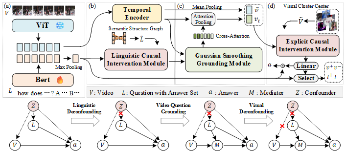

# <a href="https://arxiv.org/pdf/2503.07635"> Cross-modal Causal Relation Alignment for Video Question Grounding </a>



Video question grounding (VideoQG) requires models to answer the questions and simultaneously infer the relevant video segments to support the answers. However, existing VideoQG methods usually suffer from spurious cross-modal correlations, leading to a failure to identify the dominant visual scenes that align with the intended question. Moreover, vision-language models exhibit unfaithful generalization performance and lack robustness on challenging downstream tasks such as VideoQG. In this work, we propose a novel VideoQG framework named Cross-modal Causal Relation Alignment (CRA), to eliminate spurious correlations and improve the causal consistency between question-answering and video temporal grounding. 

## Usage
  ### 1. Installation
  ```
  # clone the repository
  git clone https://github.com/WissingChen/CRA-GQA.git

  # create a conda environment
  conda env create -f requirements.yml
  ```

  ### 2. Datasets
  The CRA framework is evaluated on two VideoQG datasets: [NextGQA](https://github.com/doc-doc/NExT-GQA) and [STAR](https://bobbywu.com/STAR/). 

  #### prepare the data

  You can follow the preprocessing procedure mentioned in NextGQA to obtain the corresponding video features, QA annotations, and the required timestamps for evaluation.

  #### sample the multi-modal feature for Causal Internvention

  After preparing the above-mentioned data, you can proceed with further processing using the `.ipynb` file provided in the root directory.

  `sample_linguistic_feature.ipynb` -> semantic structure graph feature $\hat{L}$
  `sample_visual_feature.ipynb` -> video feature $\hat{V}$

  #### file structure
  ```bash
  data/
    ├── nextgqa
    │   ├── causal_feature
    │   ├── frame2time_test.json
    │   ├── frame2time_val.json
    │   ├── gsub_test.json
    │   ├── gsub_val.json
    │   ├── map_vid_vidorID.json
    │   ├── test.csv
    │   ├── train.csv
    │   ├── train_gpt4_sub.json
    │   ├── upbd_test.json
    │   ├── upbd_val.json
    │   └── val.csv
    ├── nextqa
    │   ├── frames
    │   ├── test.csv
    │   ├── train.csv
    │   ├── val.csv
    │   └── video_feature
    ├── star
    │   ├── causal_feature
    │   ├── frame2time_test.json
    │   ├── frame2time_train.json
    │   ├── frame2time_val.json
    │   ├── frames
    │   ├── gsub_test.json
    │   ├── gsub_train.json
    │   ├── gsub_val.json
    │   ├── split_file.json
    │   ├── STAR_test.json
    │   ├── STAR_train.json
    │   ├── STAR_val.json
    │   ├── test.csv
    │   ├── train.csv
    │   ├── val.csv
    │   ├── video_feature
    │   └── Video_Segments.csv
  ```

  ### 3. Train
  Currently, I have only released the complete CRA code that uses **TempCLIP** as the backbone(however, I have included the core code and results in the **FrozenBiLM** folder).

  First, after preparing the data, you should modify the relevant parameters in the config folder, including the data path, etc.

  Then, you can simply run the `main.py` file directly.

  ### 4. Inference
  During the inference stage, don't forget to add the weight path for **resume** in the config, and then run `main.py --infer True`.

## One More Thing

The causal module used in the paper has been integrated into the open-source causal framework [CausalVLR](https://github.com/HCPLab-SYSU/CausalVLR). We welcome everyone to explore it and provide suggestions.

## Citation 
```
@inproceedings{chen2025cross,
  title={Cross-modal Causal Relation Alignment for Video Question Grounding},
  author={Chen, Weixing and Liu, Yang and Chen, Binglin and Su, Jiandong and Zheng, Yongsen and Lin, Liang},
  booktitle={Proceedings of the IEEE/CVF Conference on Computer Vision and Pattern Recognition},
  year={2025}
}
```